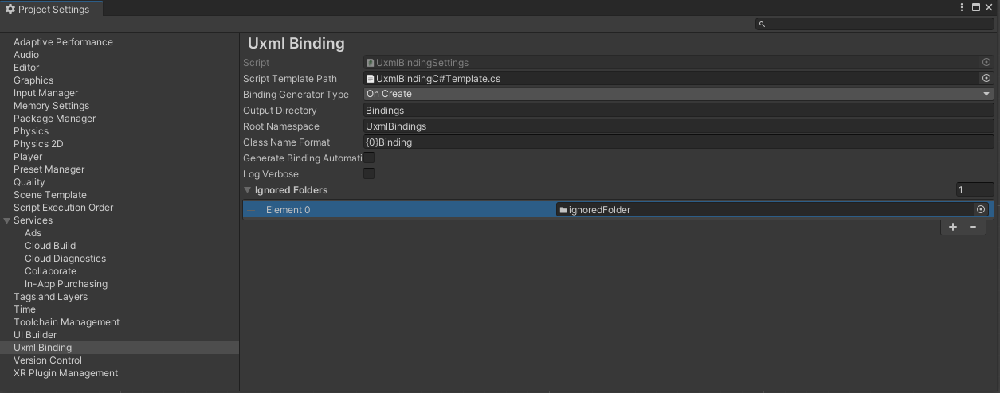

# Getting started

Once the package is added to your Unity Project, navigate to the project settings and adjust the Uxml Binding settings to your needs.

## Properties

### Script Template Path
Text Asset, which you need to assign a script template text file. You can copy the default script template from the package and adjust it at your will (-> *Assets/Editor/UxmlTemplateBinding.cs.txt*). The copying is needed for safety reasons, since you should keep your text asset within your project structure (for editing and project flavor reason). The binding will use its inner default script template, if no asset has been assigned (including a warning!)

### Binding Generator Type
The mode, in which the code queries are inserted. Depending on the type this can minimize memory usage or debuggability
| Type | Description |
| ---- | ----- |
| On Create | Queries all elements within object construction. Thus allows you to detect "null" references much easier, but increases the memory and creation process |
| LazyLoaded | Queries and caches the elements on retrieval. This spares time in initial setup, since not all elements are queried from start. |
| Proxy | Similar to lazy load, but without caching to keep the memory footprint of the struct/class itself as small as possible. |

### Output Directory
The path (relativ to project Assets folder) in which all Bindings are generated to.

### Root Namespace
Allows you to specify a custom namespace for all your binding files

### Class Name Format
The name of the generated classes. The format parameter {0} is the name of the uxml class file, which every uxml binding is referencing to.

### Generate Binding Automation
This will enable a asset post processor, which recreates needed bindings, once a VisualTreeAsset has been saved. This can be very annoying, since it recompiles on every save and recreates the UI Builder.

### Log Verbose
Enables some additional logging, if you detect strange side effects or dont understand the binding file. (like it will print skipped or not converted properties of every uxml)

### Ignored Folders
Drag folders into the list, which should not be included in the UXML parsing process. This is done recursively. Please note, that converting a single uxml by using the context menu will not check for ignored folders, since this is an explicit conversion (if you right click on an uxml and create the binding explicitly).

## Script Template

The script template will be used for every binding generation. This file should contain various replacement parameters, which the generator uses.

| Parameter | Description |
| ---- | ----- |
| #ROOTNAMESPACE# | Replaced by the setting paramter 'Root Namespace' |
| #CLASSNAME# | Replaced by the settings paramter 'Class Name Format' for every uxml file |
| #PROPERTIES# | Placeholder for each generated property (VisualElement) of the uxml file |
| #PROPERTYCONSTRUCTION# | Placeholder which allows some generation type to assign the queried elements within the constructor |

**Always provide a constructor, which contains a VisualElement parent within the constructor to fill the root/parent node.**
Feel free to customize all your binding generated code classes by adding interfaces, namespaces or custom additional properties.

## Convert UXMLs
Simply use the context menu or file menu within unity to create a/all custom binding(s)

## Additional Features

You can sanitize your generated bindings by using the *Sanitize Bindings* menu entry.  
This will detect ALL (beside ignored) VisualTreeAsset files within your project structure and check if a *Binding.cs file matches a *.uxml file within the project. If one or more inconsistencies are found, it will allow you to remove the binding files one-by-one or all at once.

